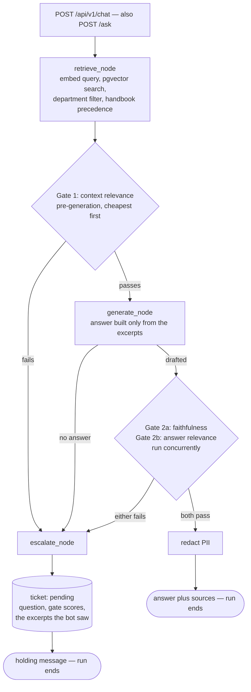
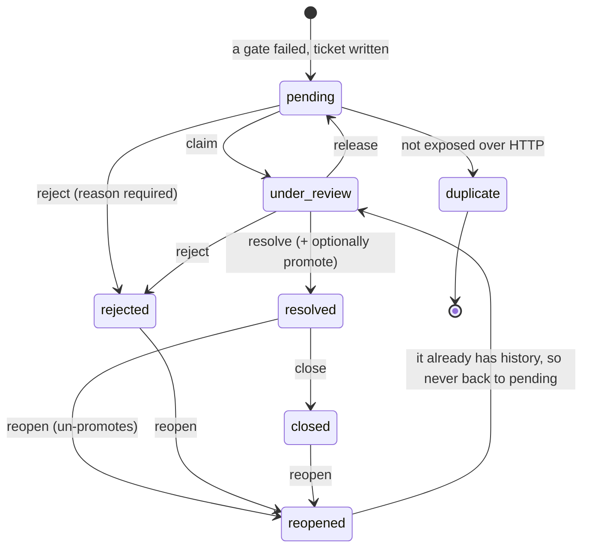
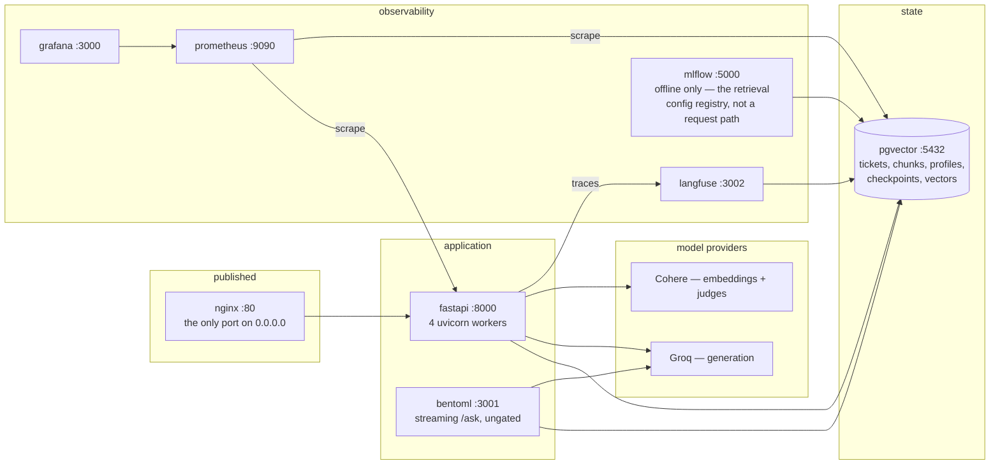

# 🎧 Handbook Assistant — Higher Institute Customer Support Agent

[](https://github.com/OmarAmir2001/Customer_Support/actions/workflows/ci.yml)
[](https://www.python.org/)
[](https://fastapi.tiangolo.com/)
[](https://langchain-ai.github.io/langgraph/)
[](https://github.com/pgvector/pgvector)
[](https://prometheus.io/)
[](LICENSE)

> An AI agent that answers student questions from the CS and IS department handbooks, escalates the ones it cannot answer confidently to a human advisor, and learns from resolved escalations — through a human-gated promotion step, not automatically.

**Status:** 🟢 The whole loop runs end to end — retrieval, three orthogonal judge gates, escalation to a human, resolution delivered back into the same conversation, and human-gated promotion into the knowledge base. Dockerised, instrumented with Prometheus, Grafana and Langfuse, evaluated offline with RAGAS, 250 tests in CI.

---

## What is this?

A support agent for the Higher Institute for Computer Science and Information Systems' CS and IS handbooks. Unlike a static FAQ bot, it runs a **Corrective RAG loop with confidence-gated escalation**: when the agent cannot answer from the handbook with confidence, it stops, writes a ticket, and routes the question to a human academic advisor instead of guessing.

The escalation is a **lifecycle, not an event**. The graph run ends the moment it escalates — nothing stays parked in memory waiting for a human who may take days. When an advisor resolves the ticket, a second write reconnects to the same conversation through its `thread_id`, and the student reads the answer whenever they next return.

Resolved answers can then be promoted back into the knowledge base as `instructor_resolved` chunks, so the same question is answered automatically next time. Promotion is a **separate, deliberate act** — never a side effect of resolving.

This is the second project in a 4-part AI engineering portfolio, building on patterns from [Mizan](https://github.com/OmarAmir2001/mizan) (CRAG, long-term memory) and adding orthogonal confidence gating, an async ticket lifecycle, and a human-gated learning loop.

---

## Core design principles

- **One source of truth, one derived index.** Postgres holds the authoritative state — tickets, chunks, conversation checkpoints. The pgvector collection is a **rebuildable projection** of it. Data flows one way: source → vectors. Drop the collection and re-push; nothing authoritative is lost.
- **Escalation is decided by orthogonal judges, never a self-reported confidence score.** Three single-purpose checks, each judging a different thing against different evidence. Escalate if **any** fails. No "rate your confidence 0–1" — models are badly calibrated at that, and averaging several prompts of the same model adds no independent information.
- **Escalation ends the run; resolution is a separate write.** An open ticket costs a database row, not a live process. That is what survives a restart and scales past a handful of open tickets.
- **The judges fail closed.** An unparseable or unreachable judge escalates to a human. Failing open would wave answers through precisely when the verification machinery is broken.
- **Promotion is human-gated and additive-only.** The handbook always outranks promoted ticket answers, enforced at retrieval — pgvector has no concept of "authoritative", and ticket answers are phrased in student language, so they out-retrieve formal policy text unless you rank deliberately.
- **Thin nodes, real logic in controllers.** A graph node reads state, calls one controller method, writes the result back. Every controller is testable without a graph, and the advisor's HTTP endpoint reuses the exact method the graph uses.

---

## Architecture

Three diagrams, because the system has three shapes that do not fit in one: what
happens to a question, what happens to a ticket afterwards, and what is actually
deployed.

### What happens to one question



Gate 1 scores **coverage** of the retrieved excerpts, before paying for a generation call. Gate 2a decomposes the drafted answer into individual claims and scores `supported / total`. Gate 2b deliberately **does not see the excerpts** — an answer can be perfectly grounded and still answer the wrong question, and showing it the excerpts would reintroduce exactly the blind spot faithfulness already has.

Redaction runs **after** the gates, not before: the judges score the answer the model actually produced, and scoring a string containing `[PHONE]` against the excerpts would read as an unsupported claim and escalate a good answer.

### What happens to the ticket, hours or days later

The graph run is over. Nothing is parked in memory waiting for a human — an open
ticket costs a database row, which is what survives a restart.



Resolving does two derived writes, both idempotent and repairable from the ticket alone, so neither can fail the advisor's request after their answer has committed:

```
POST /api/v1/escalation/tickets/{id}/resolve
   │
   ├─► written into the persisted thread state, keyed by the ticket's thread_id
   │   → the student reads it from GET /api/v1/chat/{thread_id} on their next visit
   │
   └─► if promote_to_kb: embedded into pgvector as `instructor_resolved`,
       tagged with ticket_id, via delete-then-insert so a re-sync cannot duplicate it
```

The advisor queue (`GET /api/v1/escalation/tickets?ticket_status=pending`) hands over the question, which gate tripped and why, and the excerpts the bot actually saw — so the advisor is not re-deriving what went wrong.

### What is deployed



Everything except nginx binds to `127.0.0.1`. Postgres is shared by the app, Langfuse and MLflow as separate databases — one server, three schemas, because three Postgres containers on a laptop is a worse trade than one with three databases.

---

## What works today

Verified end to end against real Postgres and live model calls:

- ✅ **Three orthogonal judge gates** — context relevance (pre-generation), faithfulness and answer relevance (post-generation, concurrent). Every verdict emits one `gate_evaluated` log line with score and threshold.
- ✅ **Confidence-gated escalation** with the judge's own reason string as the advisor-facing summary.
- ✅ **Fail-closed judges** — an unparseable verdict escalates rather than passing.
- ✅ **Ticket lifecycle** — `pending → under_review → resolved / rejected`, plus `release` back to the queue, `closed`, `reopened` from any end state, and `duplicate` (reserved for phase 2). Every transition the state machine permits has an endpoint, guarded by a test that fails if one is ever added without one. Full `ticket_status_history` trail with actor and note, and optimistic concurrency: the expected status is in the `UPDATE ... WHERE`, so two advisors acting at once cannot silently overwrite each other — the loser gets a `409`, not a `500`.
- ✅ **Passive delivery** — the advisor's answer is written into the LangGraph checkpointer under the original `thread_id`; the student pulls it on return.
- ✅ **Human-gated promotion** — `promote_to_kb` on resolve; idempotent delete-then-insert keyed on `ticket_id`; un-promoting, rejecting or reopening removes the vector row, while **closing keeps it** — closing is the happy ending of a resolution, not a retraction.
- ✅ **Handbook review queue** — `?promotion_held=true` lists the tickets whose answers the contradiction check blocked, over a partial index built for exactly that query.
- ✅ **Department-aware retrieval** — a CS student is never answered from the IS handbook.
- ✅ **Handbook precedence at retrieval** — relevance decides which chunks are used, precedence decides the order they are presented in.
- ✅ **The learning loop closes** — a question that escalated is answered automatically once its resolution is promoted.
- ✅ **Structured logging** — structlog, JSON, with the graph's `thread_id` bound as `correlation_id`. One grep follows a question from the chat request through each gate verdict into the ticket and on to the advisor's resolution. Uvicorn and SQLAlchemy log through the same renderer, so every line is the same shape.
- ✅ **Ingestion pipeline** — upload, chunk, embed, push to pgvector, with every chunk tagged `source` and `department` so the filter and the ranking have something real to work with.
- ✅ **Alembic migrations** and a Postgres checkpointer, both running automatically in the container.
- ✅ **Long-term student memory** — one patched profile per student (identity, not history). Extraction is frequency-gated (most turns cost no model call), runs on a smaller model, and happens after the response is sent. A patch can never delete a known fact.
- ✅ **The stored profile outranks the request body** for `department`, so a student cannot read the other handbook by claiming to be in it.
- ✅ **Conversation transcript** — turns accumulate across runs through a reducer, so an advisor's answer appends instead of overwriting. Bounded in storage (a trim reducer) and in the prompt (a turn cap plus a character budget, oldest evicted first).
- ✅ **Human-gated promotion judges** — a generalizability check sets the advisor's checkbox default, and a contradiction check *holds* promotion and flags the handbook for review. Deliberately asymmetric: only the contradiction check can block, because a wrong generalizability call would silently discard good knowledge while a wrong hold is merely visible. Both fail safe, in opposite directions.
- ✅ **Section-aware chunking** — markdown splits on its own headings, so a chunk's `section` is a real citable path (`... > أحكام وشروط الدراسة > مادة (١٠)`) rather than a character offset.
- ✅ **Idempotent handbook re-ingest** — `sync_sections` delete-then-inserts per `(source, section)`, so pushing twice replaces rather than duplicates, with no full collection rebuild.
- ✅ **A reproducible corpus** — `dvc repro` rebuilds it from tracked handbooks and `params.yaml`, deterministically, with eight validation checks that refuse to write a bad corpus. Its content hash is the data version a metric can be attributed to.
- ✅ **Three-command Docker setup** via `make up`, a Locust load profile, and 250 passing tests that need no database, no API keys and no configuration.
- ✅ **Metrics that stay bounded** — Prometheus + Grafana, with request labels keyed on the *route template*. `/api/v1/chat/{thread_id}` is one series; labelling by raw path would mint a permanent series per conversation UUID and grow until Prometheus runs out of memory. Counters are recorded in a `finally`, so unhandled exceptions appear in the error rate instead of vanishing, and the registry is multiprocess-aware because uvicorn runs several workers.
- ✅ **Metrics that describe *this* system, not a generic web app** — `customer_support_questions_total{outcome,failed_gate,department}` and `customer_support_judge_failures_total{gate}`. The second is the one that matters: because the judges fail closed, a degrading model provider escalates every question while `/chat` keeps returning `200` with normal latency and zero errors. A fail-closed judge produces the *same* gate reason as a genuine low score, so that counter is the only thing in the system that can tell "the provider is down" from "retrieval is bad" — and those need opposite responses.
- ✅ **Alerts with structural thresholds** — seven rules, validated by `promtool`. Most are derived from something the system guarantees (a healthy judge never fails; `max_connections` is 100; a target is up or it is not) rather than from a traffic baseline that does not exist yet.
- ✅ **PII guardrails in both scripts** — emails, phone numbers, national IDs and Luhn-checked card numbers, in Western *and* Arabic-Indic digits, redacted from answers, dropped from anything long-term memory would persist, and scrubbed before anything is sent to Langfuse. Over-redaction is the failure that gets a guardrail switched off, so every pattern requires a phone or ID shape rather than a run of digits — `135` credit hours, a `2.0` GPA and `مادة (٢٤)` are left alone, and the test suite asserts that using strings from the real corpus. Streaming needed its own redactor: redacting chunk by chunk emits half a phone number in the clear, because neither half matches alone.
- ✅ **Query drift and token cost** — cosine against the evaluation set's centroid on every question (free: the query vector already exists), and provider-reported token usage with the price as an editable Grafana constant.
- ✅ **Offline evaluation with RAGAS** — faithfulness, answer relevance, context precision and context recall over 62 bilingual questions, judged by a different provider than the one serving, so scoring a run cannot throttle the system being scored.
- ✅ **One trace per question in Langfuse** — trace id *is* the `thread_id`, so a trace and its log lines join without guessing from timestamps. Tracing is optional and fails silently: with the keys unset every call is a no-op.
- ✅ **A genuinely streaming endpoint** — BentoML, tokens as the model produces them. Ungated by necessity and it says so in its own payload, because the post-generation judges need a complete answer to score.

---

## Tech stack

| Component               | Technology                                                |
| ----------------------- | --------------------------------------------------------- |
| Agent framework         | LangGraph (Postgres checkpointer)                         |
| LLM — generation        | Groq · `openai/gpt-oss-120b`                              |
| LLM — judges            | Groq · `openai/gpt-oss-20b` (smaller: up to 3 calls/question) |
| Embeddings              | Cohere · `embed-multilingual-light-v3.0` (384-dim)        |
| Vector store            | pgvector                                                  |
| Tickets, chunks, assets | Postgres · SQLAlchemy 2 async + asyncpg                   |
| Migrations              | Alembic                                                   |
| Validation              | Pydantic v2 + pydantic-settings                           |
| API layer               | FastAPI                                                   |
| Logging                 | structlog (JSON, correlation ids)                         |
| Data versioning         | DVC — handbooks and derived corpus, `dvc repro` pipeline   |
| Metrics                 | prometheus-client → Prometheus → Grafana                  |
| Reverse proxy           | nginx (the only service bound to `0.0.0.0`)               |
| Packaging               | uv · Python 3.13                                          |
| Local orchestration     | Docker Compose · `make`                                   |

**One database, three drivers.** The app talks to Postgres over **asyncpg**, LangGraph's `AsyncPostgresSaver` over **psycopg 3**, and Alembic over **psycopg2**. All three URLs are built from the same `Settings` object, so they cannot drift.

> There is no MongoDB. Earlier design notes describe Mongo as the source of truth for tickets; that was consolidated onto Postgres, which means resolving a ticket — loading thread state and writing the promoted answer to vectors — touches one database.

A Qdrant provider also exists behind the same `VectorDBInterface`, selectable with `VECTOR_DB_BACKEND=QDRANT`, but only the pgvector path is exercised.

---

## Knowledge base

Built from the institute's official handbooks in `data/handbooks/`:

- `CS_2023.md` — Computer Science
- `IS_2023.md` — Information Systems

Chunks are embedded into pgvector with metadata that retrieval depends on:

| Metadata key | Purpose                                                              |
| ------------ | -------------------------------------------------------------------- |
| `source`     | `CS_2023` / `IS_2023` / `instructor_resolved` — drives precedence      |
| `department` | `CS` / `IS` / unset (shared) — drives the retrieval filter            |
| `section`    | Handbook section, so an answer can be traced back                     |
| `ticket_id`  | On promoted answers only: the stable key the sync deletes and re-inserts by |

`source` is normalised to the handbook name rather than the file path, because stored filenames carry a random prefix (`3EsFAHwA7Z8L_CS_2023.md`) and precedence matches on `source`.

---

## Running it

### Docker — three commands

```bash
git clone https://github.com/OmarAmir2001/Customer_Support.git && cd Customer_Support
cp .env.example .env
make up
```

**Between the second and third command you must edit two lines of `.env`:**
`GROQ_API_KEY` (generation — free tier is enough) and `COHERE_API_KEY` (embeddings
and the judges). Everything else in `.env.example` has a working default, including
the Postgres credentials, so those two keys are the whole of the manual step. Without
them the app boots and then fails on its first model call, which is the right
direction to fail but not an obvious one — hence saying it here rather than letting
you find out.

Use `make rebuild` instead of `make up` to build the image first.

That starts Postgres with pgvector, waits for it to accept connections, applies migrations, and brings up the API behind nginx. `POSTGRES_HOST` is overridden to the `pgvector` service name inside the network, so the same `.env` works on the host and in the container. `make help` lists the rest — `make check` validates the compose file without starting anything, `make monitoring` prints where the dashboards are, and `make targets` shows which scrape targets Prometheus currently has up.

| | | |
|---|---|---|
| nginx | <http://localhost> | the front door — the only port bound to `0.0.0.0` |
| API | <http://127.0.0.1:8000> | direct, bypasses nginx. Docs at `/docs` |
| Grafana | <http://127.0.0.1:3000> | datasource and dashboard provisioned at boot |
| Prometheus | <http://127.0.0.1:9090> | `make targets` lists what it is scraping |

### What is monitored

Four of the exported metrics are specific to this system, and they exist because its
worst failure is invisible in HTTP terms. The judges **fail closed**: if the model
provider degrades, every question escalates while `/chat` returns `200` with normal
latency and no errors. A request-rate panel would look perfect throughout.

| Metric | Answers |
|---|---|
| `customer_support_questions_total{outcome,failed_gate,department}` | escalation rate, and which gate caused it |
| `customer_support_judge_failures_total{gate}` | **is the provider degrading?** — the leading indicator |
| `customer_support_query_drift_cosine` | **are students asking about things the handbook does not cover?** |
| `customer_support_tokens_total{model,kind}` | what the system costs, by model and direction |
| `customer_support_requests_total{method,endpoint,status_code}` | traffic and errors, labelled by route template |
| `customer_support_request_latency_seconds{method,endpoint}` | latency, including the checkpointer-bound conversation read |

**Drift and escalations are read together**, and that pairing is the point. Drift is
the cosine between each question's embedding and the centroid of the 62 evaluation
questions — the same set the gate thresholds and the chunking sweep were tuned
against, so distance from it means distance from the conditions under which every
quality number in this README was measured. Escalations rising *with drift falling* is
a **corpus** problem: write more handbook, or promote more ticket answers. Escalations
rising with drift flat is a **provider** problem. Without the second signal those two
look identical, and they need opposite responses.

The warning line on the drift panel is **0.33**, which is the 5th percentile of the
eval questions' own similarity to their centroid (`data/eval/drift_baseline.json`) —
the spread of known-good questions, rather than a round number chosen by eye.
Measuring costs nothing: retrieval has already embedded the query in order to search
with it, so this is one dot product over a vector that exists either way.

Token counts come from the **providers' own usage fields**, not from a character
estimate — Arabic and English tokenise very differently in these models, so an
estimate would be wrong by a language-dependent factor. Prices are Grafana dashboard
constants (`price_in`, `price_out`, at the top of the dashboard) rather than numbers
baked into PromQL, so a rate-card change is an edit and not a deploy. Streamed
responses are not counted: usage requires `stream_options`, and risking the stream for
a cost panel is the wrong trade.

The judge-failure counter is the important one. A fail-closed judge returns the same
gate reason as a judge that genuinely scored an answer low, so by the time the
escalation reaches the ticket, the logs and the escalation count, the two are
indistinguishable. It is incremented at the only point that still knows the
difference — inside `_judge`, one line before the fallback verdict is built.

Alerts live in `docker/prometheus/alerts.yml` and are visible at
<http://localhost:9090/alerts>. Their thresholds are labelled **structural** (derived
from something the system guarantees — a healthy judge never fails, `max_connections`
is 100) or **behavioural** (derived from what normal traffic looks like). Only one is
behavioural, and it is deliberately set at "obviously broken" rather than "unusual",
because there is no baseline yet and a threshold guessed tight cries wolf until
someone mutes it. **Delivery is not wired** — routing to email or Slack needs an
Alertmanager service, which is not in the compose file.

Every service has a memory limit, sized at roughly double its measured usage. Limits
do not prevent a spike; they stop one service's spike from becoming another's outage.
Without them the host OOM killer picks a victim by size rather than importance, and
the largest process here is the API while the most load-bearing is Postgres.

> **Grafana's password lives in its volume, not in `.env`.** The env var seeds the
> account on the first boot of a fresh `grafana_data` volume; after that the stored
> value wins — including a change made through the UI, which Grafana prompts for on
> first login. So changing `.env` alone does nothing to a running install, and a
> password changed in the browser will not match `.env`. To move both:
>
> ```bash
> docker exec customer_support_grafana \
>   grafana cli --homepath /usr/share/grafana admin reset-admin-password <new>
> # then set GF_SECURITY_ADMIN_PASSWORD in .env so a fresh volume matches
> ```
>
> The reset runs a secret migration first, so give it a second before testing.

Everything except nginx is bound to loopback on purpose. Prometheus has no
authentication of its own, node-exporter mounts the host filesystem read-only, and a
database on `0.0.0.0` is reachable from anything that can route to the host. nginx
also refuses the metrics path: Prometheus scrapes the app directly over the compose
network, so `/TrhBVe` never needs a public route — and an unlisted path behind a
catch-all `location /` is hidden from nobody.

**Why `make` and not `docker compose` directly.** The compose file lives in `docker/` while the stack is built and configured from the repo root, and that needs two flags:

```bash
docker compose -f docker/docker-compose.yml --env-file .env up -d
```

`--env-file` is load-bearing. Compose takes its *project directory* from the compose file's location, so without it `${POSTGRES_USERNAME}` is looked up in `docker/.env` and silently expands to an empty string. `--project-directory ..` is **not** the fix — it also re-roots every relative path in the file, turning `env_file: ../.env` into a path outside the repo. `--env-file` changes only where variables come from.

`.dockerignore` stays at the repo root on purpose: Docker resolves it against the build *context*, which is the root, not against the Dockerfile's directory.

### Locally with uv

```bash
docker compose -f docker/docker-compose.yml --env-file .env up -d pgvector   # just the DB
cp .env.example .env               # POSTGRES_HOST=localhost
cp alembic.ini.example alembic.ini

uv sync --extra dev
uv run alembic upgrade head
uv run uvicorn customer_support.main:app --reload
```

`--extra dev` is not optional if you want the tooling: a bare `uv sync` resolves to the
runtime dependencies only and *removes* pytest, ruff and locust from the venv.

Set `LOG_JSON=false` for coloured, human-readable logs while developing; keep JSON everywhere else.

Running locally is a single process, so `PROMETHEUS_MULTIPROC_DIR` is unset and the
default in-process registry is used. Only the container sets it, because only the
container runs multiple workers.

### The corpus, and reproducing it

The handbooks are the raw input, not the corpus. `scripts/build_corpus.py` turns them
into a structured corpus — one record per handbook section, each carrying a `source`,
a `department`, a `section` path and a **citation** a student can actually look up.

```bash
uv run --extra dev dvc repro          # rebuild only if inputs or params changed
uv run --extra dev dvc repro --force  # rebuild regardless
uv run --extra dev dvc dag            # show the stage graph
```

`data/handbooks/` and `data/corpus/` are tracked by **DVC**, not git — a file cannot
have two owners, and git would keep resurrecting a stale copy. `data/handbooks.dvc`
and `dvc.lock` are the committed pointers.

**Chunking parameters live in `params.yaml`**, read by both the DVC stage and (later)
the MLflow experiment runner, so the two can never disagree about which configuration
produced a given corpus. DVC watches those values: change `chunk_size` and `dvc repro`
rebuilds; change nothing and it skips the stage.

Three properties are deliberate and verified:

- **Deterministic.** Two forced rebuilds produce the same `content_sha256`. That hash
  is the corpus *version*, which is what lets a metric be attributed to the exact data
  that produced it rather than to a timestamp.
- **Validated before it is written.** Eight checks run first — empty text, unknown
  source, missing department, unlabelled section, oversized chunk, duplicate id, and
  a handbook that contributed nothing. A failing build writes **nothing at all**,
  because a parsing bug is silent here and becomes a hallucination three steps later.
- **Shared with the API.** The script reuses `ProcessController.process_file_content`
  rather than reimplementing the splitting, so the two cannot drift. At the same
  `chunk_size`, both produce 97 chunks for `CS_2023` — which is checked, not assumed.

> **A remote is not configured in this repo.** The DVC remote is intentionally in
> `.dvc/config.local`, which is gitignored: it points at a path on one machine, and
> shipping it would hand a reviewer a broken remote. Configure your own before
> `dvc pull` will work on a fresh clone —
> `dvc remote add -d storage <url>` with Google Drive or S3.

### Loading the knowledge base

```bash
# 1. Upload a handbook (.md, .pdf, .txt, or a pre-chunked .json)
curl -F "file=@data/handbooks/CS_2023.md" \
     http://127.0.0.1:8000/api/v1/admin/ingest/1

# 2. Chunk it into Postgres
curl -X POST http://127.0.0.1:8000/api/v1/admin/process/1 \
     -H 'Content-Type: application/json' \
     -d '{"chunk_size":1000,"overlap":50,"do_reset":1}'

# 3. Embed and index into pgvector
curl -X POST http://127.0.0.1:8000/api/v1/admin/knowledge_base/push/1 \
     -H 'Content-Type: application/json' -d '{"do_reset":1}'
```

`KB_COLLECTION_NAME` must match the project you pushed (`collection_1` for project `1`).

### Tests

```bash
make test                            # or: uv run --extra dev pytest tests -q --no-cov
```

No database, no API keys, no graph — the gates, the ticket state machine and the retrieval ranking are all pure logic by design.

### Offline evaluation and chunking experiments

With the stack running and provider keys configured, preview the experiment without
making any API calls:

```bash
uv run --extra dev python scripts/run_experiment.py --dry-run
```

Start with one configuration and a subset. This generates answers and measures
RAGAS context precision, context recall, faithfulness and answer relevancy:

```bash
uv run --extra dev python scripts/run_experiment.py --chunk-size 1000 --overlap 50 --limit 20
```

This consumes Groq and Cohere quota. Check your account's daily token budget before
running; sequential workers do not increase it. Omit `--chunk-size` to compare all
five configurations, and use `--limit 0` for the full question set. A full sweep can
exceed free-tier daily quota. `--limit 20` selects a deterministic subset
covering both languages, both departments and unanswerable questions. Unanswerable
questions retain their generated responses but are excluded from reference-based
RAGAS averages; they have no factual reference answer.

Experiments rebuild into their own report directories and index `collection_9001`,
separate from the live assistant. MLflow at `http://127.0.0.1:5000` records parameters,
all four metrics, generated answers, contexts, evaluation and corpus hashes, corpus
artifacts, configuration, and code/dependency snapshots. Reports live under
`reports/experiments/<session>/`; `summary.json` links configurations to run IDs.

Answers and each successful metric are checkpointed. Scoring stops on provider
errors, including HTTP 429, rather than retrying exhausted quota. After quota
recovers, resume a stopped sweep with
`--resume-dir reports/experiments/<session>` and the same evaluation options, or
retry one report with `scripts/run_ragas.py --resume <report>` and its original
`--manifest` and `--limit`. Missing answers, failed metric jobs and non-finite scores
fail the experiment instead of producing a misleading successful run. Resume reuses
valid scores and evaluates only missing metrics; fully collected reports also skip
re-indexing.

### The drift baseline

```bash
uv run --extra dev python scripts/build_drift_baseline.py --dry-run   # free
uv run --extra dev python scripts/build_drift_baseline.py             # 62 embedding calls
```

`data/eval/drift_baseline.json` is committed, so drift works on a fresh clone without
spending anything. Rebuild it when `EMBEDDING_MODEL_ID` or `EMBEDDING_MODEL_SIZE`
changes — a baseline from a different model is not comparable, and the app logs
`drift_not_comparable` and disables the metric rather than reporting a dimension
mismatch as a change in student behaviour. The script prints the eval questions' own
similarity spread; its 5th percentile is the warning line for the Grafana panel.

### What is in `reports/`

| File | What it is |
|---|---|
| `ragas_latest.json` | the most recent RAGAS run: per-question scores for all four metrics, both languages |
| `mlflow_comparison.png` | the chunking sweep as MLflow renders it |
| `experiments/<session>/` | one directory per sweep; `summary.json` maps configurations to MLflow run ids |

Per-run artefacts are gitignored — they are large, numerous and reproducible from the
scripts above. `ragas_latest.json` is the one kept under version control, so a
reviewer can read real scores without running anything.

`--register` considers only complete runs from the current comparison. Faithfulness
must reach 0.75; scores within `--tie-margin` (default 0.05) are treated as tied and
less retrieved context wins. This is a conservative tie policy, not a measured noise
floor. The selected retrieval configuration is registered as `HandbookRetrieval`,
and its `production` alias and legacy Production stage are verified to agree.

---

## API

| Method | Path                                             | Purpose                                            |
| ------ | ------------------------------------------------ | -------------------------------------------------- |
| `GET`  | `/`                                              | Liveness — app name and version. What the container healthcheck probes |
| `GET`  | `/health`                                        | Readiness — `{status, documents_indexed}`. `degraded` if the collection cannot be counted |
| `POST` | `/api/v1/chat`                                   | Ask a question. Returns `{answer, sources[], escalated, ticket_id}` |
| `POST` | `/ask`                                           | The same handler as `/api/v1/chat`, on the name the rubric uses. Not the BentoML `/ask` — see below |
| `GET`  | `/api/v1/chat/{thread_id}`                       | Read a conversation, including an advisor's answer  |
| `GET`  | `/api/v1/escalation/tickets`                     | Advisor queue. Filter by `ticket_status`, `department`, `promotion_held`; paginated |
| `GET`  | `/api/v1/escalation/tickets/{id}`                | Full ticket: gate scores and the excerpts the bot saw |
| `POST` | `/api/v1/escalation/tickets/{id}/claim`          | `pending → under_review`                            |
| `POST` | `/api/v1/escalation/tickets/{id}/resolve`        | Deliver an answer, optionally promote it to the KB  |
| `POST` | `/api/v1/escalation/tickets/{id}/release`        | `under_review → pending` — hand a claimed ticket back |
| `POST` | `/api/v1/escalation/tickets/{id}/reject`         | Refuse the question. `reason` required              |
| `POST` | `/api/v1/escalation/tickets/{id}/close`          | `resolved → closed`. Keeps the promoted answer in the KB |
| `POST` | `/api/v1/escalation/tickets/{id}/reopen`         | Send a finished ticket back. Un-promotes it         |
| `POST` | `/api/v1/escalation/tickets/{id}/promotion-assessment` | What the Section 5 judges advise about a draft |
| `POST` | `/api/v1/admin/ingest/{project_id}`              | Upload a handbook file. Returns `asset_id`          |
| `POST` | `/api/v1/admin/process/{project_id}`             | Chunk uploaded files into Postgres. `file_id` takes the `asset_id` from `/ingest`, or a filename |
| `POST` | `/api/v1/admin/knowledge_base/push/{project_id}` | Embed and index chunks into pgvector                |
| `POST` | `/api/v1/admin/knowledge_base/search/{project_id}` | Debug retrieval exactly as the agent sees it      |
| `GET`  | `/api/v1/admin/index_info/info/{project_id}`     | Collection stats                                    |

`sources[]` carries **citations, not chunk ids** — `CS_2023 — مادة (٢٤)`, the section a student can open and check. A promoted ticket answer cites its ticket instead. A chunk that cannot name its origin is omitted rather than given a placeholder, and the list is empty on an escalation, where the `answer` field holds the holding message rather than an answer.

There are **two endpoints called `/ask`** and they are not the same thing. This one, on the FastAPI app, is the gated path: three judge gates, escalation, the full contract above. The other is on the BentoML service (`:3001`) and **streams** — tokens appear as the model produces them, which cannot be gated, because faithfulness and answer relevance can only be scored on a complete answer. That service says so in its own payload. PII redaction runs on both.

`/api/v1/profile/{student_id}` returns what long-term memory knows about a student, and `DELETE` on it wipes that profile (privacy and reset requests). Conversation history is read per thread from `GET /api/v1/chat/{thread_id}`, keyed by `thread_id` exactly as the checkpointer stores it.

Every transition the state machine permits is now reachable over HTTP, `duplicate` excepted — nothing should be able to park a ticket in a terminal state by hand until duplicate detection exists to justify it. A lifecycle call answers `404` for a missing ticket, `409` for a move the ticket's state refuses *or* for losing a race to another advisor, and `400` for a broken invariant such as a reason-less rejection.

---

## Project structure

```
src/customer_support/
  main.py                    # lifespan: build clients, wire layers, compile the graph
  helpers/
    config.py                # Settings — every threshold and model id
    logging_config.py        # structlog + correlation ids
    citations.py             # chunk -> a citation a reader can check
    pii.py                   # PII detection, redaction, and a streaming redactor
    drift.py                 # cosine, centroid, and the baseline loader
    tracing.py               # Langfuse: one trace per question, one span per node
    locale.py                # language negotiation, including detection from the question
  graph/                     # thin nodes + edges + wiring, no logic
    nodes.py  edges.py  builder.py  dependencies.py
  controllers/               # all real logic lives here
    RetrievalController.py   # pgvector query, department filter, precedence
    GradingController.py     # the three judge gates
    GenerationController.py  # answer drafting
    EscalationController.py  # ticket lifecycle + vector sync (the only writer)
    judge_prompts.py         # prompts + provenance labelling, versioned as code
    ProcessController.py     # chunking + metadata tagging
    KBController.py          # embed and index
    DataController.py  ProjectController.py  BaseController.py
  models/                    # data shapes, plus the SQL that persists them
    TicketModel.py           # the only place ticket SQL is issued
    ChunkModel.py  AssetModel.py  ProjectModel.py
    db_schemas/.../ticket.py # tickets + ticket_status_history tables
    enums/                   # GateEnum, TicketStatusEnum (the state machine)
    graph/graph_state.py     # the typed state flowing through the graph
    llm_schemas/             # GateResult, JudgeVerdict — parsed LLM output
  routers/                   # HTTP only: no queries, no prompts
    chat.py  escalation.py  admin.py  health.py  schemas/
  utils/
    metrics.py               # Prometheus: route-template labels, escalation, drift, tokens
  bento_service.py           # BentoML: the streaming, ungated /ask
  stores/                    # external systems behind interfaces
    checkpointer.py          # LangGraph Postgres saver
    llm/                     # LLMInterface + OpenAI/Groq and Cohere providers
    vectordb/                # VectorDBInterface + pgvector and Qdrant providers
migrations/                  # Alembic (ignores LangGraph's own checkpoint tables)
data/handbooks/              # CS_2023.md, IS_2023.md — DVC-tracked raw input
data/corpus/                 # derived corpus + manifest — a DVC stage output
dvc.yaml  params.yaml        # the reproducible pipeline and its parameters
scripts/build_corpus.py      # raw handbooks -> validated, citable corpus
scripts/index_corpus.py      # corpus -> pgvector, idempotent
scripts/build_drift_baseline.py  # eval questions -> the drift reference centroid
scripts/run_ragas.py         # offline scoring
scripts/run_experiment.py    # the chunking sweep, logged to MLflow
data/eval/questions.json     # 62 bilingual questions with ground truth
data/eval/drift_baseline.json    # the committed drift centroid (384 dims)
reports/                     # RAGAS scores, the MLflow comparison, sweep outputs
handbook/                    # the original scanned PDFs, archival source of truth
docker/                      # Dockerfile, compose file, entrypoint, monitoring config
  Dockerfile                 # built with the REPO ROOT as context
  docker-compose.yml         # paths point up; see "Why make" above
  docker-entrypoint.sh       # waits for Postgres, migrates, then starts uvicorn
  nginx/default.conf         # proxies the API, refuses the metrics path
  prometheus/prometheus.yml  # scrape config: app, Postgres, host, Qdrant
  prometheus/alerts.yml      # 7 rules; thresholds marked structural vs behavioural
  grafana/provisioning/      # datasource + dashboard provider, applied at boot
  grafana/dashboards/        # dashboard JSON, loaded from disk
tests/                       # gates, transitions, ranking, locales, memory, promotion
  load/locustfile.py         # read-only and full-pipeline load profiles
Makefile                     # wraps the compose flags so they cannot be forgotten
.dockerignore                # stays at the ROOT: resolved against the build context
```

**Dependency direction:** `routers/` and `graph/` call `controllers/`; `controllers/` call `models/` and `stores/`. Never the reverse. `EscalationController` receives the graph as an injected `thread_writer` rather than importing it, so the arrow stays one-way.

---

## Configuration worth knowing

| Setting                            | Default | Why it matters                                                        |
| ---------------------------------- | ------- | --------------------------------------------------------------------- |
| `GATE_CONTEXT_RELEVANCE_THRESHOLD` | `0.5`   | Starting values, not tuned. These three are the biggest lever on the escalation rate; the `gate_evaluated` log lines are the raw material for tuning them |
| `GATE_FAITHFULNESS_THRESHOLD`      | `0.8`   |                                                                        |
| `GATE_ANSWER_RELEVANCE_THRESHOLD`  | `0.7`   |                                                                        |
| `RETRIEVAL_TOP_K`                  | `5`     | Chunks handed to the generator                                         |
| `RETRIEVAL_OVERFETCH_FACTOR`       | `3`     | Fetch `top_k × this`, because filtering discards rows                   |
| `JUDGE_MAX_OUTPUT_TOKENS`          | `1200`  | Reasoning models spend tokens before emitting JSON; too low truncates the verdict and the whole judgement is rejected |
| `INPUT_DEFAULT_MAX_CHARACTERS`     | `8000` in `.env.example` (unset = no truncation) | `generate_text` truncates its prompt to this — set it below the context size and the excerpts get cut out of the answer prompt |
| `PII_REDACTION_ENABLED`            | `true`  | Guardrails on answers, on what long-term memory persists, and on what reaches Langfuse. `false` is for reproducing a report of over-redaction, not for production |
| `LOG_JSON`                         | `true`  | `false` for coloured local logs                                        |
| `--workers` (Dockerfile `CMD`)     | `4`     | Each worker is a separate process with its own connection pool, thread pool and metrics. Changing it changes the connection budget below |
| `PROMETHEUS_MULTIPROC_DIR`         | set in the image | Without it each worker reports only its own counters, so a scrape shows roughly 1/N of real traffic |

**The connection budget.** Postgres' default `max_connections` is 100. Each worker
holds `pool_size + max_overflow` (5 + 5) plus one checkpointer connection, so the
total is `workers x 10 + workers` — 44 at the current 4. SQLAlchemy's defaults (5 +
10) would have made that 64, and the failure mode is "too many clients" appearing
only under the load that needs the connections most.

---

## Skills demonstrated

- Corrective RAG with orthogonal, single-purpose judge gates — hand-written, no eval framework in the request path
- Confidence-gated escalation with an async, durable human-in-the-loop resolution flow
- A ticket lifecycle reconnected across separate requests via `thread_id`, with a real state machine and an audit trail
- Source-of-truth discipline: an idempotent, rebuildable derived index with delete-then-insert sync keyed on a stable id
- Retrieval ranking that enforces a policy (handbook precedence) the vector store has no concept of
- Clean controller architecture — thin nodes, logic reused by both the graph and the API, testable without either
- Production logging: one renderer for app and library logs, correlation ids through `contextvars`
- Instrumentation that survives contact with production: bounded label cardinality, multiprocess-safe counters, errors recorded in a `finally` so failures cannot vanish from the error rate — and metrics chosen so the system's *own* failure mode is visible, not just HTTP's
- Offline evaluation that is separate from the request path: RAGAS over a labelled bilingual set, judged by a different provider than the one serving, so scoring cannot throttle what it scores
- Data and experiment versioning: DVC for the corpus with a content hash as the data version, MLflow for runs and a registry where "the model" is the retrieval configuration
- Guardrails written for the data that actually arrives — PII in Arabic-Indic as well as Western digits, and a streaming redactor, because redacting chunk by chunk leaks half a phone number
- Drift measured where it is free, and paired with a second signal so it can distinguish a corpus problem from a provider problem
- Cost instrumentation from provider-reported usage, with the price editable in the dashboard rather than compiled into a query
- FastAPI + Pydantic v2, SQLAlchemy 2 async, Alembic migrations, Docker Compose, BentoML, uv

---

## Why this is domain-specific, on purpose

The target is **multi-domain** — one client per deployment, configured — not multi-tenant. Multi-tenant is a different product: `tenant_id` on every table and query, KB partitioning, thread-id scoping, isolation tests.

The coupling that would have to move is shallow rather than hard. The engine layers — gates, ticket lifecycle, source-of-truth sync, locale parser, provider factories — are already domain-neutral. The academic vocabulary is confined to:

- `RetrievalController.HANDBOOK_SOURCES`
- `ProcessController.HANDBOOK_DEPARTMENTS`
- `student_profile.DEPARTMENTS`
- the two `^(CS|IS)$` patterns, in `ChatRequest` and the escalation list query
- the domain nouns in `locales/*/rag.py`, `judges.py` and `GateFailureReason`
- `student_id` as a field name (52 occurrences, and part of the public request body)

Generalising means moving those to `Settings`, putting the domain nouns behind placeholders, and adding an `attributes` JSONB bag to the profile for tenant-specific facts like `gpa`. The rule for what stays fixed: **a state field is core if the engine reads it, and an attribute if only prompts and filters read it.** A partition key must exist for retrieval to filter on; that it is called "department" and holds CS/IS is configuration.

Renaming `student_id` is the one item that gets more expensive with time, because it is part of the public request body — the cost lands the moment any client hardcodes it. Renaming the `instructor_resolved` metadata tag is *not* expensive: pgvector is a rebuildable projection, so it is a re-push.

---

## Session changelog

What landed when, from the git history. Dates are the sessions I actually worked in,
not a release schedule.

| Session | What landed |
|---|---|
| **Jul 30 – Aug 7** | Foundations: FastAPI skeleton, the `LLMInterface` + provider factory (OpenAI-compatible and Cohere), the `VectorDBInterface` with a Qdrant provider, the KB controller, chunking and ingestion, JSON corpus support |
| **Sep 15 – 18** | Postgres as the source of truth: models, enums, routers, Alembic, and a `PgVectorProvider` so the vector index became a rebuildable projection of Postgres rather than a second store |
| **Sep 21 – 22** | The agent itself: the LangGraph state machine, escalation, the ticket lifecycle, long-term student memory, language negotiation, and prompt templates split per locale |
| **Sep 23 – 25** | Production shape: Docker and the entrypoint, the promotion judges, the full set of lifecycle endpoints, Prometheus metrics with route-template labels, CI on GitHub Actions, and `tests/conftest.py` — which turns a test that silently reads your `.env` into an immediate failure |
| **Sep 29 – Oct 1** | Reproducibility: `build_corpus.py` with eight validation rules, the DVC pipeline, the 62-question bilingual evaluation set, the RAGAS harness, the chunking experiment runner, and `Retry-After`-aware rate-limit handling |
| **Oct 3 – 4** | MLflow tracking and the model registry, where "the model" is the retrieval configuration; the sweep that selects one |
| **Oct 8 – 9** | Hardened both providers (Cohere's `generate_text` had been passing a dict where v1 chat wants a string — a bare 422), made language a *detected* signal, moved the RAGAS judge to Cohere so evaluation load cannot throttle serving, added the BentoML streaming service, and Langfuse tracing keyed on `thread_id` |
| **Oct 9** | `sources[]` as real citations, `/health` with `documents_indexed`, the `/ask` alias; PII guardrails across answers, profiles and traces; query drift and token cost with the panels to read them; these diagrams |

The commits are deliberately verbose — each one states what changed and *why that
way*, including the failures that shaped it. `git log` is the long version of this
table.

## License

MIT

---

*Part of an AI Engineering portfolio. Other projects: [Mizan](https://github.com/OmarAmir2001/mizan), Research & Report Generator, AI Code Reviewer.*
